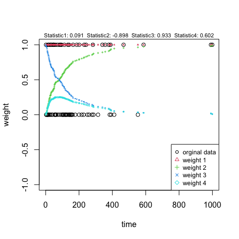

<!-- README.md is generated from README.Rmd. Please edit that file -->

# package: nphPower

<!-- badges: start -->

<!-- badges: end -->

Package: nphPower provides functions to perform combination test
including maximum weighted logrank test (MWLR) and projection test, to
calculate sample size with MWLR in a simulation-free approach allowing
for staggered entry, drop-out etc, to visualize the design parameters
and to simulate survival data with flexible design input.

## Installation

You can install the released version of nphPower from
[CRAN](https://CRAN.R-project.org) with:

    install.packages("nphPower")

``` r

library("nphPower")
```

And the development version from [GitHub](https://github.com/) with:

``` r
# install.packages("devtools")
#devtools::install_github("hcheng99/nphPower")
```

## Example 1 - perform maximum weighted logrank test

This is a basic example which shows you how to perform maximum weighted
logrank test.

Load the lung data and only keep columns for analysis.

``` r
lung <- nphPower::lung
tmpd <- with(lung, data.frame(time = SurvTime, stat = 1-censor, grp = Treatment))
```

Generate the weight functions for maxcombo test

``` r
wmax <- gen.wgt(method = "Maxcombo")
```

Perform the test using pooled Kaplan-Meier estimate of CDF as base
function and visualize the weight functions

``` r
t1 <- MaxLRtest(tmpd, Wlist = wmax, base = c("KM"),
  alternative = c("two.sided"))
plot(t1)
```

 \#\#
Example 2 - sample size under proportional hazard The design setting is:
5 years’ entry time and 5 years’ follow-up time; Median survival for
control group is 10 years. The hazard ratio comparing treatment and
control is 0.5.

``` r
t_enrl <- 5; t_fup <- 5 ; lmd0 <- -log(0.2)/10 ; HR <- 0.5
eg1 <- pwr2n.LR(method = "schoenfeld", lambda0 = lmd0,
  lambda1 = lmd0*HR, entry = t_enrl, fup = t_fup)
#> ------------------------------------------ 
#>  -----Summary of the Input Parameters----- 
#> ------------------------------------------ 
#>        __Parameter__      __Value__
#>              Method     schoenfeld
#>  Lambda1/Lambda0/HR 0.08/0.161/0.5
#>          Entry Time              5
#>      Follow-up Time              5
#>    Allocation Ratio              1
#>        Type I Error           0.05
#>       Type II Error            0.1
#>         Alternative      two.sided
#>  Drop-out Parameter   Not Provided
#> ------------------------------------------ 
#>  -----Summary of the Output Parameters----- 
#>  ------------------------------------------ 
#>                __Parameter__ __Value__
#>            Number of Events    87.479
#>  Number of Total Sampe Size   153.173
#>          Overall Event Rate     0.571
```

## Example 3 - sample size under nonproportional hazard

Design setting: patients are enrolled within 12 months and the last
enrolled patient has at least 18 months’ follow-up. The medial survival
time for control group is 12 months. The treatment has delayed effects.
The hazard ratio is 0.75 after 6 months. Maxcombo test is used.

``` r
t_enrl <- 12; t_fup <- 18; lmd0 <- log(2)/12
f_hr_delay <- function(x){(x<=6)+(x>6)*0.75}
f_haz0 <- function(x){lmd0*x^0}
snph1 <- pwr2n.NPH(entry = t_enrl, fup = t_fup, Wlist = wmax,
 k = 50, ratio = 2, CtrlHaz = f_haz0, hazR = f_hr_delay)
#> -----Summary of the Input Parameters----- 
#>          parameter     value
#>             Method     MaxLR
#>         Entry Time        12
#>     Follow-up Time        18
#>   Allocation Ratio         2
#>       Type I Error      0.05
#>      Type II Error       0.1
#>        Alternative two.sided
#>  Number of Weights         4
#> -----Summary of the Output Parameters----- 
#>                    parameter    value
#>            Number of Events 1198.779
#>  Number of Total Sampe Size 1720.967
#>            Asymptotic Power    0.900
#>          Overall Event Rate    0.697
```

## Example 4 - trial data simulation

A time-to-event data set with settings in example 3 is simulated.

``` r
N <- round(snph1$totalN, digits = 0)
set.seed(12345)
simu1 <- simu.trial(type = "time", trial_param = c(N,t_enrl,
  t_fup), bsl_dist = "weibull", bsl_param = c(1,lmd0),
  HR_fun = f_hr_delay, ratio = 1)
#> Notes: Drop-outs are not considered in the simulation.
#>  -------- Summary of the Simulation -------- 
#>                 parameter value
#> 1             Trial Type:  time
#> 2             Entry Time:    12
#> 3 Maximum Study Duration:    30
#> 4     Number of Subjects:  1721
#> 5       Number of Events:  1259
```

More functions can be found in the package.
